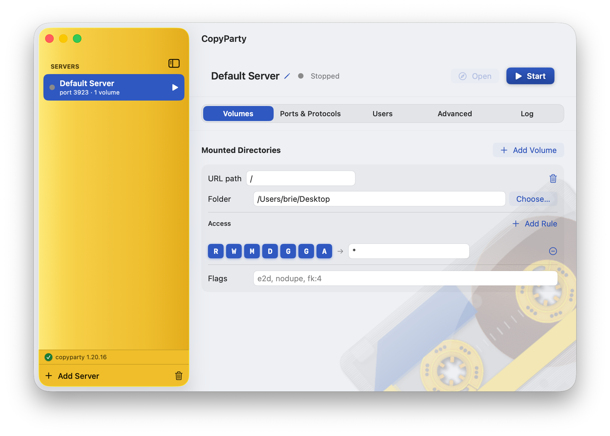
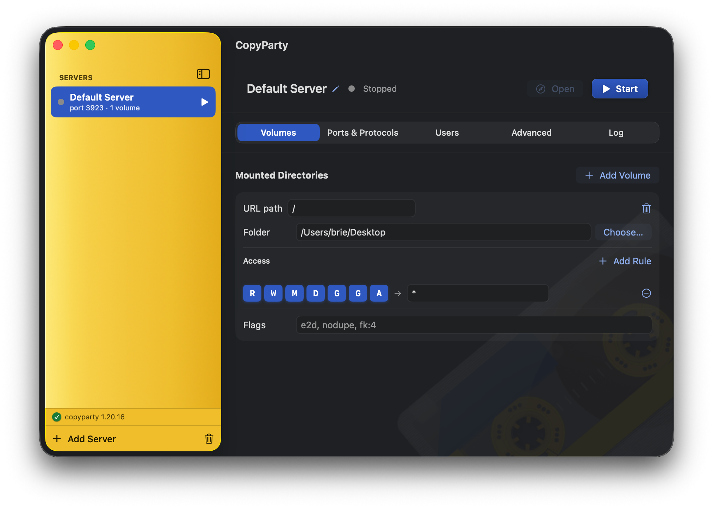

# CopyParty.app

A native **SwiftUI macOS GUI** for the [copyparty](https://github.com/9001/copyparty)
file server. It bundles its **own self-contained, batteries-included Python
runtime** and `copyparty-sfx.py`, so there is nothing to install — launch the
app, point it at a folder, and press **Start**.

<p align="center">
  
  
</p>

A glossy 80s-cassette-yellow sidebar (derived from the app icon), a neutral
detail pane, and contrast tuned with APCA-style polarity so text stays crisp in
both light and dark mode.

---

## Table of contents

- [Features](#features)
- [Concepts](#concepts)
- [Protocols & default ports](#protocols--default-ports)
- [Access permissions](#access-permissions)
- [Saving & loading configurations](#saving--loading-configurations)
- [Updating copyparty](#updating-copyparty)
- [Architecture](#architecture)
- [Building from source](#building-from-source)
- [How the embedded runtime is assembled](#how-the-embedded-runtime-is-assembled)
- [Building a notarized release](#building-a-notarized-release)
- [Troubleshooting & caveats](#troubleshooting--caveats)
- [Versioning](#versioning)
- [Credits & licensing](#credits--licensing)

---

## Features

- **Self-contained & batteries-included.** Embeds a relocatable CPython 3.12.13
  ([python-build-standalone](https://github.com/astral-sh/python-build-standalone))
  plus `copyparty-sfx.py` **and** copyparty's optional dependencies — `paramiko`
  (SFTP), `Pillow` (thumbnails), `mutagen` (media tags), `impacket` (SMB),
  `argon2-cffi` (argon2 hashing). No system Python, nothing to `pip install`.
- **Multiple servers.** Each server is its own copyparty process with its own
  ports, so you can serve **different directories on different ports**
  simultaneously. Start/stop/restart each independently.
- **Any number of volumes per server**, each with its own URL path, filesystem
  path, per-user access rules, and volflags.
- **Full protocol gamut** — HTTP, HTTPS, WebDAV, FTP, FTPS, SFTP, TFTP, SMB,
  Zeroconf/mDNS discovery, and console QR codes.
- **User management** with granular per-volume permissions.
- **Save / load configurations** — export one or all servers to a portable,
  versioned JSON bundle and import setups back in.
- **Live log console** streaming each server's stdout/stderr, with copy.
- **Open in browser** for a running server's HTTP interface.
- **copyparty update checker** — semantic-version comparison against the latest
  GitHub release, with in-place download of a newer `copyparty-sfx.py`.
- **Custom About window** with version, copyright, and full icon attribution.
- **Unmasked Dock icon** — defeats the macOS 26 squircle mask so the full-bleed
  cassette artwork renders correctly (see
  [`DockIcon.swift`](Sources/Services/DockIcon.swift)).
- **Themed, contrast-correct UI** — a glossy full-height cassette-yellow sidebar,
  neutral detail pane, cobalt accents, a translucent cassette watermark, and
  text contrast tuned with APCA-style polarity for both appearances. Editing the
  server name requires an explicit action (double-click / pencil) so a stray
  keystroke can't rename it.

## Concepts

| Term | Meaning |
|------|---------|
| **Server instance** | One copyparty process with its own ports, volumes, users, and global options. Modeled by `ServerInstance`. Run several at once for per-port isolation. |
| **Volume** | A mounted directory: a URL path (`/music`) mapped to a filesystem path, plus access rules and volflags. |
| **Account** | A copyparty user (`username` + `password`). |
| **Access rule** | A permission combo (e.g. `rw`) granted to a set of principals (usernames, or `*` for everyone incl. anonymous). |

copyparty serves **every volume on every listening port** within a single
process — so isolating a directory to a specific port means running a **separate
instance**, which is exactly what the multi-server model provides.

## Protocols & default ports

Configured per server in the **Ports & Protocols** tab.

| Protocol | Default | copyparty flag | Notes |
|----------|---------|----------------|-------|
| HTTP / HTTPS | `3923` | `-p` / `-i` | Primary web UI. TLS mode: auto (self-signed) / HTTP-only / HTTPS-only; custom `--cert` supported. |
| WebDAV | (HTTP ports) | `--no-dav`, `--dav-auth` | Rides on the HTTP/HTTPS ports; on by default. |
| FTP | `3921` | `--ftp` | Plus optional `--ftp-nat` and passive port range `--ftp-pr`. |
| FTPS | `3990` | `--ftps` | Explicit-TLS FTP. |
| SFTP | `3922` | `--sftp`, `--sftp-pw` | Provided by bundled paramiko; host keys auto-generate on first run. |
| TFTP | `3969` | `--tftp` | Port 69 is standard but needs root. |
| SMB | `445` | `--smb`, `--smbw` | Experimental & insecure; port 445 needs root. |
| Zeroconf | — | `-z`, `--zm` | mDNS + SSDP discovery / announcement. |
| QR code | — | `--qr` | Printed to the log on start. |

## Access permissions

Each volume's access is a list of rules. A rule grants a **permission combo** to
**principals** (usernames, or `*`). The permission letters:

| Letter | Meaning |
|--------|---------|
| `r` | read (browse + download) |
| `w` | write (upload) |
| `m` | move / rename |
| `d` | delete |
| `g` | get (download by exact URL, no browsing) |
| `G` | upget (get + see own upload's filekey) |
| `a` | admin |

Example: a rule of `rw` for `ed, k` and a rule of `r` for `*` produces this in
the generated config:

```ini
[/music]
  /Users/you/Music
  accs:
    r: *
    rw: ed, k
```

## Saving & loading configurations

Your servers persist automatically to
`~/Library/Application Support/CopyParty/servers.json`. To move setups between
machines or keep named presets:

- **File ▸ Export All Configurations…** (`⇧⌘S`) — write every server to a JSON
  bundle.
- **File ▸ Export Selected Server…** (`⌘E`) or **sidebar ▸ right-click ▸
  Export…** — export a single server.
- **File ▸ Import Configuration…** (`⌘O`) — append servers from a bundle.
  Imported servers get fresh IDs, so re-importing never collides.

A bundle is a versioned envelope (`format: copyparty-app-config`) containing an
array of full server definitions — so a single file can carry several servers,
each with multiple volumes/endpoints, users, and protocol settings.

## Updating copyparty

The **Advanced** tab (or **CopyParty ▸ Check for copyparty Updates…**) queries
the [9001/copyparty](https://github.com/9001/copyparty) GitHub releases, compares
the latest tag against the running engine's version, and — if newer — downloads
`copyparty-sfx.py` into Application Support. The app prefers a downloaded sfx
over the bundled one, so updates apply without rebuilding. Restart running
servers to pick up the new engine.

## Architecture

| Layer | Files |
|-------|-------|
| Models | `Sources/Models/` — `ServerInstance`, `Volume`, `Account`, `ProtocolSettings` (all `Codable`) |
| Config generation | `Sources/Services/ConfigWriter.swift` — renders copyparty's `-c` config (`[global]` / `[accounts]` / `[/url]`) |
| Config bundles | `Sources/Services/ConfigBundle.swift` — portable export/import |
| Runtime resolution | `Sources/Services/PythonRuntime.swift` — locates the embedded `python3` + active sfx, parses versions |
| Process management | `Sources/Services/ServerController.swift` — one `Process` per server, live log capture, start/stop/restart |
| State + persistence | `Sources/Services/ServerStore.swift` — `[ServerInstance]` persisted as JSON |
| Updates | `Sources/Services/UpdateService.swift` — GitHub release check + semver compare + download |
| Dock icon | `Sources/Services/DockIcon.swift` — unmasked Dock icon on launch |
| UI | `Sources/Views/` — `NavigationSplitView` sidebar + tabbed editor (Volumes / Ports & Protocols / Users / Advanced / Log) + About window |

## Building from source

Requires Xcode and [XcodeGen](https://github.com/yonaskolb/XcodeGen)
(`brew install xcodegen`).

```sh
# 1. Download the embedded Python runtime + copyparty-sfx.py + optional deps
./scripts/fetch-vendor.sh

# 2. (Re)generate the app icon from the canonical .icns  [optional]
./scripts/make-appicon.sh

# 3. Generate the Xcode project from project.yml
xcodegen generate

# 4. Build — the embed-vendor build phase copies Vendor/ into the .app
xcodebuild -project CopyParty.xcodeproj -scheme CopyParty -configuration Debug build

# …or just open CopyParty.xcodeproj in Xcode and Run.
```

## How the embedded runtime is assembled

- `scripts/fetch-vendor.sh` downloads the latest python-build-standalone arm64
  CPython into `Vendor/python`, `pip install`s the optional dependencies into it,
  and downloads `copyparty-sfx.py` into `Vendor/copyparty`. Pinned versions are
  recorded in `Vendor/manifest.json` (committed); `Vendor/` itself is
  git-ignored.
- `scripts/embed-vendor.sh` runs as an Xcode build phase and `rsync`s the runtime
  + sfx + raw `A-Side.icns` into the built app's `Contents/Resources` before code
  signing.
- The app is **non-sandboxed** (`CopyParty.entitlements`) and ad-hoc signed for
  local development; hardened runtime is off.

## Building a notarized release

`scripts/build-release.sh` produces a **Developer ID-signed, hardened-runtime,
notarized, stapled** app packaged as both a `.dmg` and a `.zip`. Day-to-day dev
builds stay ad-hoc — release signing lives entirely in this script, so the normal
`xcodegen`/`xcodebuild` loop is unaffected.

Because the app embeds a full CPython runtime (~85 `.dylib`/`.so` files plus the
native `python3.12`), the script signs **every** Mach-O inside-out with the
hardened runtime before sealing the bundle, then submits it to Apple and staples
the ticket. The embedded interpreter is signed with `CopyParty.entitlements`
(`disable-library-validation` + `allow-dyld-environment-variables`) so it can load
the bundled extensions under the hardened runtime.

```sh
# One-time: store App Store Connect API key credentials in the keychain
# (the key needs only the "Developer" role)
xcrun notarytool store-credentials "CopyParty-Notary" \
  --key    /path/to/AuthKey_XXXXXXXXXX.p8 \
  --key-id XXXXXXXXXX \
  --issuer xxxxxxxx-xxxx-xxxx-xxxx-xxxxxxxxxxxx

# Single notarized build of the current Vendor/ runtime (dmg + zip)
scripts/build-release.sh

# Signing-only dry run (no credentials needed) — verify signing locally
NOTARIZE=0 scripts/build-release.sh
```

`build-release.sh` is parameterized via env: `ARCHS` (`"arm64"` or `"arm64 x86_64"`),
`SIGN_MODE` (`developer-id`|`adhoc`), `NOTARIZE`, `LABEL`, `MAKE_DMG`, `MAKE_ZIP`,
plus `CODESIGN_IDENTITY`/`TEAM_ID`/`NOTARY_PROFILE`. The embedded runtime arch must
match `ARCHS` — see the vendor scripts below.

### Universal (Intel + Apple Silicon) runtime

python-build-standalone ships per-arch (no universal2), so a universal app is
assembled by fetching both and `lipo`-merging every Mach-O:

```sh
VENDOR_ARCH=universal scripts/fetch-vendor.sh   # fat arm64+x86_64 Vendor/python
scripts/thin-vendor.sh arm64                    # thin a universal tree back to one arch
```

x86_64 dependencies are pip-installed under Rosetta; `cryptography` is capped at
`<49` because newer releases dropped their Intel-macOS wheel.

### One-command release (all flavors → GitHub)

`scripts/release-github.sh` builds three flavors and publishes a GitHub release:

| Flavor | Arch | Signing | Files |
|--------|------|---------|-------|
| **universal** | arm64 + x86_64 | Developer ID + notarized | `.dmg`, `.zip` |
| **arm64** | Apple Silicon | Developer ID + notarized | `.dmg`, `.zip` |
| **adhoc** | arm64 + x86_64 | ad-hoc, **not** notarized | `.zip` |

```sh
scripts/release-github.sh             # dry run — builds everything, prints the gh command
PUBLISH=1 scripts/release-github.sh   # also creates the GitHub release for the current tag
```

Artifacts land in `build-release/release-<version>/`. The ad-hoc build is for
self-builders / offline use; after download, clear quarantine to launch it:
`xattr -dr com.apple.quarantine CopyParty.app`.

## Troubleshooting & caveats

- **Privileged ports.** TFTP port 69 and SMB port 445 require running as root.
  Defaults use safe high ports (TFTP 3969); change them if you can elevate.
- **SMB** in copyparty is experimental and insecure — enable it knowingly.
- **Video thumbnails / transcoding** additionally need an `ffmpeg` binary, which
  is not bundled. Image thumbnails (Pillow) and audio tags (mutagen) work out of
  the box.
- **Distribution.** Dev builds are non-sandboxed + ad-hoc signed. For shipping
  outside your Mac, use `scripts/build-release.sh` (hardened runtime + Developer ID
  + notarization); see [Building a notarized release](#building-a-notarized-release)
  (and note the icon's NonCommercial license).
- **First SFTP start** generates host keys under
  `~/Library/Preferences/copyparty/` — expect a short delay.

## Versioning

This project follows [Semantic Versioning](https://semver.org/) and keeps a
[CHANGELOG](CHANGELOG.md). `MARKETING_VERSION` / `CURRENT_PROJECT_VERSION` live in
`project.yml`; tagged releases are published on GitHub.

## Credits & licensing

- **Source code:** [MIT](LICENSE).
- **App icon & bundled components:** not covered by MIT — see [NOTICE](NOTICE).
  In particular the icon is **NonCommercial** (CC BY-NC-SA 3.0).
- Directed and co-authored using **Anthropic's Claude Opus 4.8**.
- App icon: the **"A-Side" cassette tape** icon by
  [barkerbaggies](https://www.deviantart.com/barkerbaggies)
  ([SoftIcons page](https://www.softicons.com/object-icons/cassette-tape-icons-by-barkerbaggies/a-side-icon)),
  licensed under
  [CC BY-NC-SA 3.0 Unported](https://creativecommons.org/licenses/by-nc-sa/3.0/).
  Because that license is **NonCommercial**, this artwork (and any build using
  it) may not be used commercially. Attribution is shown in the in-app **About
  CopyParty** window.
- copyparty is © its authors ([9001/copyparty](https://github.com/9001/copyparty)).

© 2026 Brielle Harrison. All rights reserved.
