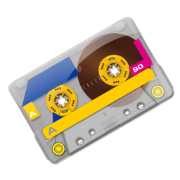

# CopyParty.app

A native macOS GUI for the [copyparty](https://github.com/9001/copyparty) file
server. It bundles its **own self-contained Python runtime** and
`copyparty-sfx.py`, so there is nothing to install — launch the app, point it at
a folder, and press **Start**.



## Features

- **Self-contained & batteries-included** — embeds a relocatable CPython
  ([python-build-standalone](https://github.com/astral-sh/python-build-standalone))
  plus `copyparty-sfx.py` **and** copyparty's optional dependencies (paramiko,
  Pillow, mutagen, impacket, argon2-cffi) inside the `.app`. No system Python,
  nothing to `pip install`.
- **Multiple servers** — each server is its own copyparty process with its own
  ports, so you can serve different directories on different ports
  simultaneously.
- **Mount any number of directories** per server, each with its own URL path and
  per-user access rules.
- **Full protocol gamut** — HTTP / HTTPS, WebDAV, FTP, FTPS, **SFTP**, TFTP, SMB
  (experimental), plus Zeroconf/mDNS discovery and console QR codes.
- **User management** — define accounts and grant them granular permissions
  (read / write / move / delete / get / upget / admin) per volume.
- **Save / load configurations** — export one or all servers to a portable,
  versioned JSON bundle (one file can carry several servers, each with multiple
  endpoints) and import setups back in, from the File menu or the sidebar
  context menu.
- **Live log console** streaming each server's stdout/stderr.
- **Update checker** — compares the bundled copyparty version against the latest
  GitHub release and downloads `copyparty-sfx.py` in place.

## Architecture

| Layer | Files |
|-------|-------|
| Models | `Sources/Models/` — `ServerInstance`, `Volume`, `Account`, `ProtocolSettings` (all `Codable`) |
| Config generation | `Sources/Services/ConfigWriter.swift` — renders copyparty's `-c` config format (`[global]` / `[accounts]` / `[/url]`) |
| Runtime resolution | `Sources/Services/PythonRuntime.swift` — locates the embedded `python3` + active sfx (a downloaded update wins over the bundled copy) |
| Process management | `Sources/Services/ServerController.swift` — one `Process` per server, live log capture, start/stop/restart |
| State + persistence | `Sources/Services/ServerStore.swift` — `[ServerInstance]` persisted as JSON in Application Support |
| Updates | `Sources/Services/UpdateService.swift` — GitHub release check + semantic version compare + download |
| UI | `Sources/Views/` — `NavigationSplitView` sidebar + tabbed editor (Volumes / Ports & Protocols / Users / Advanced / Log) |

Each **server instance** maps to one `python copyparty-sfx.py -c <generated.conf>`
process. copyparty serves every volume on every listening port within one
process, so isolating a directory to a specific port means running a separate
instance — which is exactly what the multi-server model provides.

## Building

Requires Xcode and [XcodeGen](https://github.com/yonaskolb/XcodeGen)
(`brew install xcodegen`).

```sh
# 1. Download the embedded Python runtime + copyparty-sfx.py into Vendor/
./scripts/fetch-vendor.sh

# 2. Generate the Xcode project from project.yml
xcodegen generate

# 3. Build (the embed-vendor build phase copies Vendor/ into the .app)
xcodebuild -project CopyParty.xcodeproj -scheme CopyParty -configuration Debug build

# …or just open CopyParty.xcodeproj in Xcode and Run.
```

`Vendor/` is git-ignored and reproduced by `fetch-vendor.sh`; the pinned
versions are recorded in `Vendor/manifest.json`. The app icon is generated from
a 512/1024px source PNG by `scripts/make-appicon.sh`.

## Notes & caveats

- The app is **non-sandboxed** (see `CopyParty.entitlements`): it spawns a child
  process that binds arbitrary network ports and reads user-selected folders,
  both of which the App Sandbox forbids.
- **Privileged ports**: TFTP port 69 and SMB port 445 require running as root.
  Defaults use safe high ports (TFTP 3969); change them in the Ports & Protocols
  tab if you can elevate.
- **SMB** in copyparty is experimental and insecure — enable it knowingly.
- **Video** thumbnails/transcoding additionally need an `ffmpeg` binary, which is
  not bundled (image thumbnails via Pillow and audio tags via mutagen work out
  of the box).
- Built and verified against **copyparty 1.20.16** on **CPython 3.12.13**
  (Apple Silicon).

## Credits & licensing

- Directed and co-authored using **Anthropic's Claude Opus 4.8**.
- App icon: the **"A-Side" cassette tape** icon by
  [barkerbaggies](https://www.deviantart.com/barkerbaggies)
  ([SoftIcons page](https://www.softicons.com/object-icons/cassette-tape-icons-by-barkerbaggies/a-side-icon)),
  licensed under
  [CC BY-NC-SA 3.0 Unported](https://creativecommons.org/licenses/by-nc-sa/3.0/).
  Because that license is **NonCommercial**, this artwork (and any build using
  it) may not be used commercially. Attribution is shown in the in-app
  **About CopyParty** window.
- copyparty is © its authors ([9001/copyparty](https://github.com/9001/copyparty)).

© 2026 Brielle Harrison. All rights reserved.
